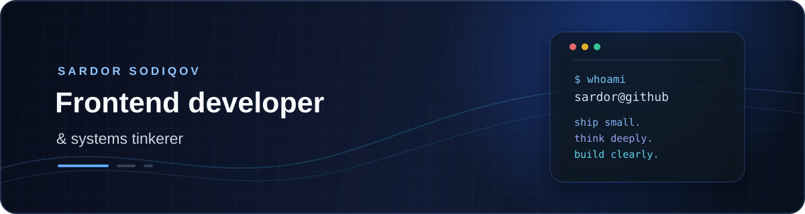

  
  

 

  
  
  
  
  
  

 

## About

I’m **Sardor Sodiqov**, a frontend-focused developer who enjoys moving between polished interfaces and low-level tools. I’m currently deepening my **React** and **TypeScript** skills while building compact, useful systems projects in **C++**.

I care about software that feels thoughtful: clear interfaces, fast feedback, small binaries, and dependable behavior. I’m based in **Tashkent, Uzbekistan (UTC+05:00)** and I’m open to collaborating on interesting frontend, developer-tooling, and systems projects.

## What I’m building

<table>
  
  <tr>
    
    <td width="50%" valign="top">
    
      <h3>Frontend craft</h3>
      
      
React interfaces, component architecture, responsive layouts, and the fundamentals that make products feel effortless to use.

      
      
<code>React</code> <code>TypeScript</code> <code>JavaScript</code> <code>CSS</code>

      
    </td>
    
    <td width="50%" valign="top">
    
      <h3>Useful systems tools</h3>
      
      
Small, focused utilities that are fast, understandable, and practical from the terminal.

      
      
<code>C++17</code> <code>Lua</code> <code>Python</code> <code>Shell</code>

      
    </td>
    
  </tr>
  
</table>

## Selected work

<table>
  
  <tr>
    
    <td width="50%" valign="top">
    
      <h3><a href="https://github.com/SodiqovSardor/snowflake">snowflake</a></h3>
      
      
Zero-dependency reverse-tunnel file sharing from the terminal. A single 51 KB C++ binary with PIN protection, ephemeral transfers, and standalone or relay modes.

      
      
<a href="https://snowflake-landing-page.vercel.app/">Live landing page →</a>

      
      
<code>C++17</code> <code>Shell</code> <code>JavaScript</code>

      
    </td>
    
    <td width="50%" valign="top">
    
      <h3><a href="https://github.com/SodiqovSardor/oNe-fetch">oNe-fetch</a></h3>
      
      
A minimal system information tool inspired by neofetch and fastfetch, with curated distro artwork and a flexible Lua configuration system.

      
      
<code>C++17</code> <code>Lua</code> <code>Python</code>

      
    </td>
    
  </tr>
  
  <tr>
    
    <td width="50%" valign="top">
    
      <h3><a href="https://github.com/SodiqovSardor/WhiteRose">WhiteRose</a></h3>
      
      
A git-aware shell concept focused on safer workflows: destructive-command guardrails, auto-upstream behavior, force-push protection, and recovery-friendly ergonomics.

      
      
<code>C++</code> <code>Git</code> <code>Shell</code>

      
    </td>
    
    <td width="50%" valign="top">
    
      <h3>Frontend experiments</h3>
      
      
Exploring React through focused projects such as <a href="https://github.com/SodiqovSardor/React">React</a>, <a href="https://github.com/SodiqovSardor/DummyShop">DummyShop</a>, <a href="https://github.com/SodiqovSardor/lider-stone">lider-stone</a>, and <a href="https://github.com/SodiqovSardor/landing">landing</a>.

      
      
<code>React</code> <code>TypeScript</code> <code>JavaScript</code> <code>CSS</code>

      
    </td>
    
  </tr>
  
</table>

## Toolkit

  
  
  
  
  
  
  
  
  
  
  
  
  
  
  
  
  

## Currently

- Building stronger instincts around **React**, hooks, state management, and component architecture.
- 
- Shipping small, focused C++ tools that solve real terminal problems.
- 
- Improving project documentation, demos, and the details that make software easier to adopt.
- 
- Always happy to pair, review a pull request, or talk through a systems idea.
- 

## Let’s connect

  
  
  

  
  
<strong>A small note</strong>strong>
summary>
  
   
  
  The best projects are often the ones that make a complicated task feel simple. That’s the kin</strong>

  </tr>

  </tr>

</table>

  </tr>

</table>

