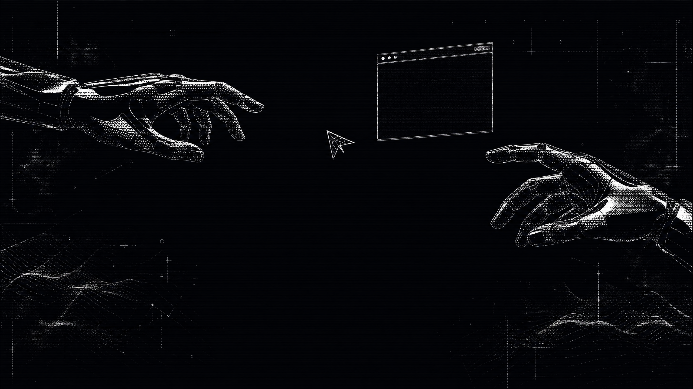

 

# Hi, I'm Sardor Sodiqov

### Frontend Developer · Systems Tinkerer

I build clean interfaces, practical developer tools, and small systems that feel good to use.

---

## About Me

I’m a developer based in **Tashkent, Uzbekistan**, focused on the space between polished frontend work and useful low-level tooling.

I’m currently sharpening my **React** and **TypeScript** skills while building compact tools with **C++**, **Python**, **Lua**, and **Shell**. My favorite projects turn a complicated workflow into something small, fast, and understandable.

I care about strong interfaces, thoughtful architecture, reliable behavior, and documentation that makes a project easier to adopt.

---

## What I Build

### Frontend Craft

React interfaces, responsive layouts, component systems, and the details that make products feel effortless.

### Useful Systems Tools

Small terminal-first utilities with clear behavior, low overhead, and practical everyday value.

### Developer Experience

Safer workflows, better project structure, useful demos, and documentation that respects the reader’s time.

---

## Selected Work

### [snowflake](https://github.com/SodiqovSardor/snowflake)

A zero-dependency reverse-tunnel file-sharing tool from the terminal. A compact C++ binary with PIN-protected sharing, one-time transfers, and standalone or relay modes.

[Live landing page →](https://snowflake-landing-page.vercel.app/)

`C++17` `Shell` `JavaScript`

### [oNe-fetch](https://github.com/SodiqovSardor/oNe-fetch)

A minimal system-information tool with distro artwork and Lua configuration, designed to stay fast and easy to understand.

`C++17` `Lua` `Python`

### [WhiteRose](https://github.com/SodiqovSardor/WhiteRose)

A git-aware shell concept focused on safer workflows, destructive-command guardrails, upstream handling, and recovery-friendly ergonomics.

`C++` `Git` `Shell`

### Frontend Experiments

Focused projects exploring React, TypeScript, JavaScript, and responsive UI:

[React](https://github.com/SodiqovSardor/React) · [DummyShop](https://github.com/SodiqovSardor/DummyShop) · [lider-stone](https://github.com/SodiqovSardor/lider-stone) · [landing](https://github.com/SodiqovSardor/landing)

---

## Connect

---

## Tech Stack

---

## GitHub Stats

---

## Activity Graph

---

### Thanks for stopping by.

If you find something useful here, feel free to star it or say hello.

