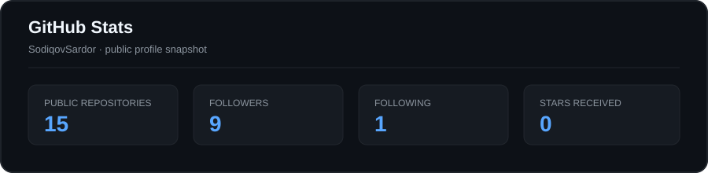

<table>
  
<tr>
  
<td width="55%" valign="middle">

# Hi, I'm Sardor Sodiqov

### Frontend Developer · Systems Tinkerer

I build clean interfaces, practical developer tools, and small systems that feel good to use.

</td>

<td width="45%" align="center">

</td>

</tr>

</table>

---

## About Me

I’m a developer based in **Tashkent, Uzbekistan**, focused on the space between polished frontend work and useful low-level tooling.

I’m sharpening my **React** and **TypeScript** skills while building compact tools with **C++**, **Python**, **Lua**, and **Shell**. I like projects that turn complicated workflows into something small, fast, and understandable.

I care about strong interfaces, thoughtful architecture, reliable behavior, and documentation that respects the reader’s time.

---

## What I Build

| Area | Focus |

| --- | --- |

| **Frontend craft** | React interfaces, responsive layouts, component systems, and polished details. |

| **Systems tools** | Small terminal-first utilities with clear behavior and low overhead. |

| **Developer experience** | Safer workflows, useful demos, better structure, and practical documentation. |

---

## Selected Work

### [snowflake](https://github.com/SodiqovSardor/snowflake)

A zero-dependency reverse-tunnel file-sharing tool from the terminal. A compact C++ binary with PIN-protected sharing, one-time transfers, and standalone or relay modes.

[Live landing page →](https://snowflake-landing-page.vercel.app/)

`C++17` `Shell` `JavaScript`

### [oNe-fetch](https://github.com/SodiqovSardor/oNe-fetch)

A minimal system-information tool with distro artwork and Lua configuration, designed to stay fast and easy to understand.

`C++17` `Lua` `Python`

### [WhiteRose](https://github.com/SodiqovSardor/WhiteRose)

A git-aware shell concept focused on safer workflows, destructive-command guardrails, upstream handling, and recovery-friendly ergonomics.

`C++` `Git` `Shell`

### Frontend Experiments

[React](https://github.com/SodiqovSardor/React) · [DummyShop](https://github.com/SodiqovSardor/DummyShop) · [lider-stone](https://github.com/SodiqovSardor/lider-stone) · [landing](https://github.com/SodiqovSardor/landing)

---

## Connect

---

## Tech Stack

---

## GitHub Stats

---

## Activity Graph

---

### Thanks for stopping by.

If you find something useful here, feel free to star it or say hello.

</tr>

</table>
